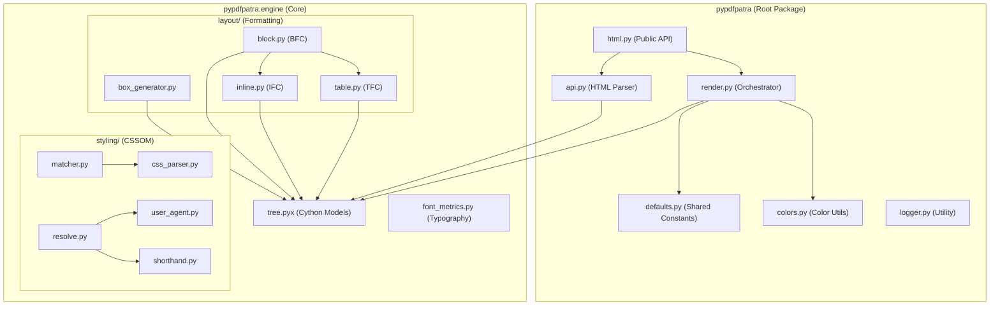

# PyPDFPatra Architecture

This document describes the structural organization of the PyPDFPatra library and the rationale behind its design.

## Library Structure

The library is organized into a core engine and high-level Python interfaces. The engine itself is divided into styling and layout sub-packages to separate concerns and improve modularity.

## Package Breakdown

| Category | Module | Responsibility |
| :--- | :--- | :--- |
| **Top-Level API** | `html.py` | Primary entry point (WeasyPrint style). |
| | `api.py` | Parses HTML into a DOM tree of `Node` objects. |
| | `render.py` | Draws the final box tree onto the `fpdf2` canvas. Handles global repetition for `position: fixed` elements. |
| **Core Engine** | `engine.tree` | High-performance Cython models for Nodes and Boxes. |
| | `engine.font_metrics` | Measures text dimensions and handles font registration. |
| | `engine.image` | Extracts metadata (dimensions) from image files. |
| **Styling** | `engine.styling.css_parser` | Extracts and parses CSS from `<style>` and `<link>` tags. |
| | `engine.styling.matcher` | Matches CSS selectors to DOM elements and applies declarations. |
| | `engine.styling.resolve` | Computes the final cascade including inheritance and UA styles. |
| | `engine.styling.user_agent` | Default W3C browser styles for HTML elements. |
| **Layout** | `engine.layout.box_generator` | Creates the Render Tree (Boxes) from the DOM (Nodes). |
| | `engine.layout.block` | Implements the Block Formatting Context (BFC) for vertical flow. |
| | `engine.layout.inline` | Implements the Inline Formatting Context (IFC) for line wrapping. |
| | `engine.layout.table` | Implements the Table Formatting Context (TFC) for grid layout. |
| **Shared** | `defaults.py` | Centralized constants for page size, margins, and typography. |
| | `colors.py` | Named colors registry and CSS color parsing. |
| | `logger.py` | Standardized logging across the library. |

## Rationale

- **Separation of Concerns:** Styling (CSSOM) is logically separated from Layout (Formatting Contexts).
- **Performance:** Core models are implemented in Cython (`tree.pyx`) to minimize overhead in large documents.
- **Centralized Configuration:** `defaults.py` ensuring consistency in page geometry and typography fallbacks.
- **Modularity:** Sub-packages (`styling`, `layout`) prevent the main `engine` directory from becoming cluttered and reduce circular dependency risks.
- **Public API Simplicity:** The `HTML` class in `html.py` hides the complexity of the 5-step pipeline (Parsing -> Styling -> Box Generation -> Layout -> Rendering).
