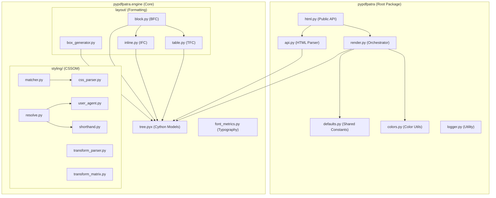

# PyPDFPatra Architecture

This document describes the structural organization of the PyPDFPatra library and the rationale behind its design.

## Library Structure

The library is organized into a core engine and high-level Python interfaces. The engine itself is divided into styling and layout sub-packages to separate concerns and improve modularity.



## Package Breakdown

| Category | Module | Responsibility |
| :--- | :--- | :--- |
| **Top-Level API** | `html.py` | Primary entry point (WeasyPrint style). |
| | `api.py` | Parses HTML into a DOM tree of `Node` objects. |
| | `render.py` | Draws the final box tree onto the `fpdf2` canvas. Handles global repetition for `position: fixed` elements. |
| **Core Engine** | `engine.tree` | High-performance Cython models for Nodes and Boxes. |
| | `engine.font_metrics` | Measures text dimensions and handles font registration. |
| | `engine.image` | Extracts metadata (dimensions) from image files. |
| **Styling** | `engine.styling.css_parser` | Extracts and parses CSS from `<style>` and `<link>` tags. |
| | `engine.styling.matcher` | Matches CSS selectors to DOM elements and applies declarations. |
| | `engine.styling.resolve` | Computes the final cascade including inheritance and UA styles. |
| | `engine.styling.user_agent` | Default W3C browser styles for HTML elements. |
| | `engine.styling.transform_parser` | Parses CSS `transform` property values into structured format. |
| | `engine.styling.transform_matrix` | Converts transform functions to PDF affine matrices and composes them. |
| **Layout** | `engine.layout.box_generator` | Creates the Render Tree (Boxes) from the DOM (Nodes). |
| | `engine.layout.block` | Implements the Block Formatting Context (BFC) for vertical flow. |
| | `engine.layout.inline` | Implements the Inline Formatting Context (IFC) for line wrapping. |
| | `engine.layout.table` | Implements the Table Formatting Context (TFC) for grid layout. |
| **Shared** | `defaults.py` | Centralized constants for page size, margins, and typography. |
| | `colors.py` | Named colors registry and CSS color parsing. |
| | `logger.py` | Standardized logging across the library. |

## Rationale

- **Separation of Concerns:** Styling (CSSOM) is logically separated from Layout (Formatting Contexts).
- **Performance:** Core models are implemented in Cython (`tree.pyx`) to minimize overhead in large documents.
- **Centralized Configuration:** `defaults.py` ensuring consistency in page geometry and typography fallbacks.
- **Modularity:** Sub-packages (`styling`, `layout`) prevent the main `engine` directory from becoming cluttered and reduce circular dependency risks.
- **Public API Simplicity:** The `HTML` class in `html.py` hides the complexity of the 5-step pipeline (Parsing -> Styling -> Box Generation -> Layout -> Rendering).

---

## CSS Transform Rendering Pipeline (Phase 9b)

The CSS `transform` property is implemented as a **visual-only transformation** that does not affect the layout process. This means:

1. **No layout impact:** Elements retain their original position and size in the document flow
2. **Rendering-time only:** Transforms are applied as PDF affine transformation matrices during the drawing phase
3. **Composable:** Multiple transforms on a single element are combined into a single 2D affine matrix

### Transform Flow

```
CSS Input: "translate(10px, 20px) rotate(45deg) scale(1.5)"
     ↓
transform_parser.py: Parse into structured format
     ↓
[
  {'type': 'translate', 'args': [10.0, 20.0], 'units': ('px', 'px')},
  {'type': 'rotate', 'args': [0.785...]},  # 45° in radians
  {'type': 'scale', 'args': [1.5, 1.5]}
]
     ↓
transform_matrix.py: Convert each function to PDF matrix & compose
     ↓
[
  translate_matrix(10, 20) →           [1, 0, 0, 1, 10, 20]
  * rotate_matrix(45deg) →         [cos(θ), sin(θ), -sin(θ), cos(θ), 0, 0]
  * scale_matrix(1.5, 1.5)      →  [1.5, 0, 0, 1.5, 0, 0]
]
     ↓
Composed Matrix: [a, b, c, d, e, f] (normalized to 6 decimals)
     ↓
box_generator.py: Store transform_matrix in Box.transform_matrix
     ↓
render.py: During drawing, extract translation (e/f) from transform_matrix and shift coordinates
     ↓
PDF Output: Element rendered with visual translation applied
```

### Supported Transform Functions

- ✅ `translate(x, y)` / `translateX(x)` / `translateY(y)` (Visually supported)
- ⬜ `scale(x, y)` / `scaleX(x)` / `scaleY(y)` (Parsed/Composed only)
- ⬜ `rotate(angle)` (Parsed/Composed only)
- ⬜ `skew(x, y)` / `skewX(x)` / `skewY(y)` (Parsed/Composed only)
- ✅ `matrix(a, b, c, d, e, f)` (Translation components supported)
- ✅ **Function composition** (multiple transforms applied left-to-right)

### Implementation Details

**Parsing Phase** (`transform_parser.py`):
- Uses regex to extract function calls from CSS string
- Parses numeric arguments and units (px, pt, deg, rad, grad, turn)
- Returns list of dicts with `type`, `args`, and optional `units`

**Matrix Computation** (`transform_matrix.py`):
- Converts each transform function to a 2×3 affine matrix (PDF format: `[a, b, c, d, e, f]`)
- Composes multiple transforms via matrix multiplication (order-sensitive)
- Normalizes matrix values to avoid floating-point precision issues in PDF

**Box Geometry Integration** (`box_generator.py`):
- Imports transform modules during box tree generation
- Parses `transform` CSS property for each element
- Normalizes length units (em, rem handled with font-size context)
- Stores final composed matrix in `Box.transform_matrix`

**Rendering Application** (`render.py`):
- Before drawing a box and its children, extracts the translation components (e, f) from the matrix.
- Shifts the `border_box_x` and `border_box_y` coordinates by these offsets.
- Recursively passes these shifts to children to ensure nested translations stack correctly.
- *Note: Full affine transformations (rotation/scaling) via PDF graphics state are deferred due to backend compatibility issues.*

### Design Rationale

1. **Separation:** Transform is applied **only during rendering**, not during layout. This keeps the layout algorithm simple and deterministic.

2. **Matrix Composition:** Rather than applying transforms sequentially (expensive), we compute a single composed matrix upfront and apply it once during rendering.

3. **Extensibility:** The modular design makes it easy to add new transform functions:
   - Add a parser function in `transform_parser.py`
   - Add a matrix generator in `transform_matrix.py`
   - Add entry to the dispatch table

4. **Graceful Degradation:** If a transform fails to parse or apply, the element still renders normally (without the transform), and a warning is issued.

---
